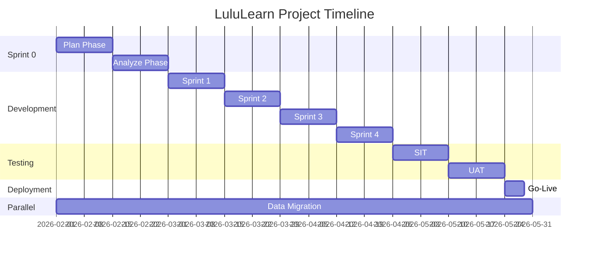
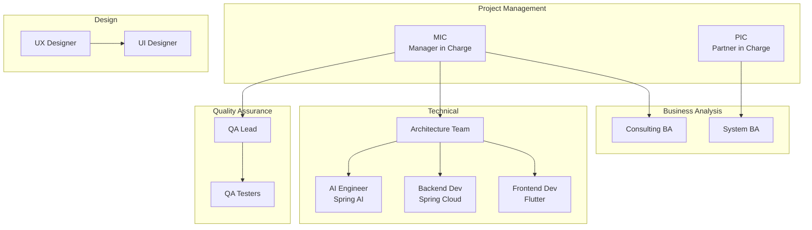

# LuluLearn - Sprint 0 Master Plan

## Document Info

| Field | Value |
|-------|-------|
| **Version** | 1.0 |
| **Created** | 2026-01-24 |
| **Methodology** | Hybrid Agile (EVD Compliant) |
| **Status** | Draft |

---

## Executive Summary

**LuluLearn** is an AI-powered educational platform that enables users to upload images for intelligent analysis. The system leverages Spring AI to process images and return meaningful insights to users. Built with a frontend-backend separation architecture using Flutter for cross-platform delivery and Spring Cloud microservices for the backend, LuluLearn targets both domestic (China) and international markets through iOS App Store, Google Play, Chinese Android marketplaces, and web application deployment.

### Key Objectives

1. Deliver an intuitive image upload and AI analysis experience across all platforms
2. Build a scalable microservices architecture on Aliyun cloud infrastructure
3. Achieve multi-platform deployment: iOS, Android (Google Play + China markets), Web
4. Ensure secure and performant AI image processing with Spring AI integration

### Success Criteria

- [ ] All core features delivered within 4 development sprints
- [ ] AI image analysis response time < 3 seconds for 95% of requests
- [ ] App store approval for iOS and Android platforms
- [ ] UAT sign-off from stakeholders
- [ ] Zero critical security vulnerabilities in penetration testing

### Key Constraints

- **Regulatory**: Chinese market deployment requires ICP license and content compliance
- **Technical**: AI model integration requires sufficient GPU resources on Aliyun
- **Timeline**: 4-sprint development window (8 weeks)
- **Multi-Store**: Must accommodate Apple, Google, and Chinese Android marketplace review processes

---

## Project Overview

### Technology Stack

| Layer | Technology | Notes |
|-------|------------|-------|
| **Frontend** | Flutter | Cross-platform: iOS, Android, Web |
| **Backend** | Spring Cloud + Spring AI | Microservices architecture |
| **Database** | PostgreSQL | Primary relational database |
| **Cloud** | Aliyun (Alibaba Cloud) | China-optimized infrastructure |
| **AI** | Spring AI | Image analysis capabilities |

### Deployment Targets

- iOS App Store
- Google Play Store
- Chinese Android Markets (Huawei, Xiaomi, OPPO, Vivo)
- Web Application (Browser-based)

---

## 7-Phase Breakdown

### Phase 1/7: Sprint 0 (Analysis & Foundation)

> **Duration**: 4 weeks (2026-02-01 to 2026-02-28)

Sprint 0 establishes project foundation through two sub-phases: **Plan** and **Analyze**.

#### Plan Sub-Phase (Week 1-2)

**Activities:**
- Develop Master Plan (this document)
- Develop Work Plan (detailed WBS)
- Develop Sprint Plans (Sprint 1-4 backlog)
- Create Project Org Chart
- Create Contact List for all participants

**Deliverables:**

| # | Deliverable | 🔏 Sign-off | Status |
|---|-------------|-------------|--------|
| 1 | Master Plan | - | ⬜ |
| 2 | Work Plan | - | ⬜ |
| 3 | Sprint Plans | - | ⬜ |
| 4 | Project Org Chart | - | ⬜ |
| 5 | Contact List | - | ⬜ |

#### Analyze Sub-Phase (Week 3-4)

**Activities:**
- Stakeholder interviews and requirements analysis
- Develop BRD (Business Requirement Document)
- Develop PRD (Product Requirement Document)
- Create Wireframes (Figma)
- Design Technical Architecture (Spring Cloud microservices)
- Design AI Integration Architecture (Spring AI)
- Setup Frontend Code Scaffold (Flutter)
- Setup Backend Code Scaffold (Spring Cloud)
- Database Design (PostgreSQL schemas)
- DevOps Pipeline Setup (Aliyun)

**Deliverables:**

| # | Deliverable | 🔏 Sign-off | Status |
|---|-------------|-------------|--------|
| 1 | Business Requirement Document (BRD) | ✅ Required | ⬜ |
| 2 | Product Requirement Document (PRD) | ✅ Required | ⬜ |
| 3 | Wireframe (Figma) | ✅ Required | ⬜ |
| 4 | Service Model Diagram | - | ⬜ |
| 5 | Technical Architecture Diagram | ✅ Required | ⬜ |
| 6 | Integration Architecture Diagram | - | ⬜ |
| 7 | Frontend Code Scaffold (Flutter) | - | ⬜ |
| 8 | Backend Code Scaffold (Spring Cloud) | - | ⬜ |
| 9 | DevOps Account List | - | ⬜ |
| 10 | Functionalities and Assignments List | - | ⬜ |
| 11 | Master Data Scripts | - | ⬜ |
| 12 | Database Design Scripts | - | ⬜ |
| 13 | IaaS and PaaS Request List | - | ⬜ |
| 14 | 3rd Party Account Request List | - | ⬜ |
| 15 | UI/UX Hi-Fi Pages | - | ⬜ |

---

### Phase 2/7: Sprint 1...4 (Iterative Development)

> **Duration**: 8 weeks (2026-03-01 to 2026-04-25)
> **Sprint Cycle**: 2 weeks per sprint

#### Sprint Structure

| Sprint | Duration | Focus Area |
|--------|----------|------------|
| Sprint 1 | Week 5-6 | Core image upload, user authentication |
| Sprint 2 | Week 7-8 | AI integration, image processing pipeline |
| Sprint 3 | Week 9-10 | Result visualization, history management |
| Sprint 4 | Week 11-12 | Polish, performance optimization, edge cases |

**Per-Sprint Activities:**
- Frontend development (Flutter) with unit testing
- Backend development (Spring Cloud) with unit testing
- Spring AI integration and testing
- Integration interface definition and development
- DevOps CI/CD pipeline execution
- Sprint planning, daily scrum, demo, retrospective

**Deliverables Per Sprint:**

| # | Deliverable | 🔏 Sign-off | Frequency |
|---|-------------|-------------|-----------|
| 1 | Frontend Functionality Code | - | Each Sprint |
| 2 | Backend Functionality Code | - | Each Sprint |
| 3 | Integration Interfaces | ✅ Required | Each Sprint |
| 4 | Database Design Updates | - | As needed |
| 5 | Project Plan Updates | - | Each Sprint |
| 6 | UI/UX Hi-Fi Pages Update | - | As needed |

---

### Phase 3/7: SIT (System Integration Test)

> **Duration**: 2 weeks (2026-04-26 to 2026-05-09)

**Activities:**
- SIT environment deployment on Aliyun
- Integration testing (Flutter ↔ Spring Cloud ↔ Spring AI)
- Functionality and business flow testing
- Defect management and fixes
- SIT report generation

**Deliverables:**

| # | Deliverable | 🔏 Sign-off | Status |
|---|-------------|-------------|--------|
| 1 | Integration Interface Test List | - | ⬜ |
| 2 | SIT Test Cases | - | ⬜ |
| 3 | SIT Test Case Results | - | ⬜ |
| 4 | SIT Report | ✅ Required | ⬜ |
| 5 | SIT Sign-Off | ✅ Required | ⬜ |

---

### Phase 4/7: UAT (User Acceptance Test)

> **Duration**: 2 weeks (2026-05-10 to 2026-05-23)

**Activities:**
- UAT environment deployment
- Performance testing (AI response times, concurrent users)
- Security testing (Penetration testing - **Mandatory**)
- Client UAT execution
- Defect fixes and change request management

**Deliverables:**

| # | Deliverable | 🔏 Sign-off | Status |
|---|-------------|-------------|--------|
| 1 | Performance Testing Scripts | - | ⬜ |
| 2 | Performance Testing Report | - | ⬜ |
| 3 | Penetration Test Cases | - | ⬜ |
| 4 | Penetration Testing Report | - | ⬜ |
| 5 | UAT Test Cases | - | ⬜ |
| 6 | UAT Test Case Results | - | ⬜ |
| 7 | UAT Report | ✅ **Client Signature Mandatory** | ⬜ |
| 8 | UAT Sign-Off | ✅ **Client Signature Mandatory** | ⬜ |

---

### Phase 5/7: Data Migration (Parallel Waterfall Thread)

> **Execution**: Runs in parallel from Sprint 0 to Go-Live

**Sub-Phases:**

| Sub-Phase | Activities |
|-----------|------------|
| **1.0 DESIGN** | Define data scope, mapping, consistency validation |
| **2.0 BUILD** | API development, data scripts, exception handlers |
| **3.0 REHEARSAL & CUTOVER** | Runbook, rehearsals, dry run, cutover |

**Deliverables:**

| # | Deliverable | 🔏 Sign-off | Status |
|---|-------------|-------------|--------|
| 1 | Data Migration Design Document | - | ⬜ |
| 2 | Data Migration Runbook | ✅ Required | ⬜ |
| 3 | Data Migration Rehearsal Report | - | ⬜ |
| 4 | Data Migration Cutover Report | ✅ Required | ⬜ |
| 5 | Rollback Plan | - | ⬜ |

---

### Phase 6/7: Go-Live (Deployment)

> **Duration**: 3-5 days (2026-05-24 to 2026-05-28)

**Activities:**
- Backend deployment to Aliyun production
- App store submissions:
  - iOS App Store (Apple review)
  - Google Play Store
  - Chinese Android Markets (Huawei, Xiaomi, OPPO, Vivo)
- WeChat Mini Program deployment (if applicable)
- Web application deployment
- Smoke testing execution
- Go/No-Go decision

**Deployment Strategy**: **Blue/Green** (Recommended for zero-downtime)

**Deliverables:**

| # | Deliverable | 🔏 Sign-off | Status |
|---|-------------|-------------|--------|
| 1 | Smoke Testing Test Cases | - | ⬜ |
| 2 | Smoke Testing Report | ✅ Required | ⬜ |
| 3 | Go-Live Communication Plan | - | ⬜ |
| 4 | Production Announcement | - | ⬜ |
| 5 | Go/No-Go Decision | ✅ Required | ⬜ |

---

### Phase 7/7: Operate (Post-Live Support)

> **Duration**: Ongoing

**Support Steps:**

| Step | Focus | Key Activities |
|------|-------|----------------|
| **1. Engagement** | Define scope & SLA | Service catalog, SLA agreement, governance |
| **2. Transition** | Knowledge transfer | Training, AUDs, operations manual |
| **3. Stabilize** | Monitor performance | SLA monitoring, issue resolution |
| **4. Optimization** | Continuous improvement | AMS automation, value enhancement |

**Support Model (ITIL-Based):**

| Level | Owner | Responsibility |
|-------|-------|----------------|
| L0 | Client | Super users, preliminary support |
| L1 | Client/Vendor | Request triage, password reset, quick support |
| L2 | Vendor | Fault repair, root cause analysis, configuration |
| L3 | Vendor | Application patches, function enhancements |
| L4 | Implementation Team | Major improvements, system upgrades |

**Deliverables:**

| # | Deliverable | 🔏 Sign-off | Status |
|---|-------------|-------------|--------|
| 1 | Service Catalog | ✅ Required | ⬜ |
| 2 | SLA Agreement | ✅ Required | ⬜ |
| 3 | Operations Manual (AUD) | - | ⬜ |
| 4 | Training Guide | - | ⬜ |
| 5 | Communication and Reporting Plan | - | ⬜ |

---

## Timeline

### Key Milestones

| Milestone | Target Date | Dependencies |
|-----------|-------------|--------------|
| Sprint 0 Complete | 2026-02-28 | BRD, PRD, Architecture sign-off |
| Sprint 4 Complete | 2026-04-25 | All features developed |
| SIT Complete | 2026-05-09 | SIT Report sign-off |
| UAT Complete | 2026-05-23 | UAT Report client signature |
| Go-Live | 2026-05-28 | Smoke testing sign-off |

---

## Team Structure

### Role Responsibilities (Sprint 0 Focus)

| Role | Sprint 0 Responsibilities |
|------|---------------------------|
| **MIC** | Overall project management, resource allocation, management review |
| **PIC** | Schedule management, risk tracking, quality improvement |
| **Consulting BA** | Stakeholder interviews, BRD development |
| **System BA** | PRD development, wireframe, user stories |
| **Architecture Team** | Tech stack, Spring Cloud services, Spring AI integration, database design |
| **UX Designer** | User experience design, interaction flows |
| **UI Designer** | Hi-Fi pages based on wireframe |

---

## Sign-off Matrix

| Phase | Deliverable | Approver | Date |
|-------|-------------|----------|------|
| Sprint 0 | BRD | Client PM | |
| Sprint 0 | PRD | Client PM | |
| Sprint 0 | Wireframe | Client PM | |
| Sprint 0 | Technical Architecture Diagram | Client PM / Tech Lead | |
| Sprint 1-4 | Integration Interfaces | Client PM / Tech Lead | |
| SIT | SIT Report | QA Lead | |
| UAT | UAT Report | **Client Executive** | |
| Data Migration | Migration Runbook | Client IT | |
| Data Migration | Cutover Report | Client IT | |
| Go-Live | Smoke Testing Report | Project Steering Committee | |
| Go-Live | Go/No-Go Decision | Project Steering Committee | |
| Operate | Service Catalog | Client Operations | |
| Operate | SLA Agreement | Client Operations | |

---

## Risk Register

| # | Risk | Probability | Impact | Mitigation |
|---|------|-------------|--------|------------|
| R1 | Apple App Store rejection | Medium | High | Early submission, follow guidelines strictly |
| R2 | Chinese Android market delays | Medium | Medium | Submit to multiple stores in parallel |
| R3 | AI model performance issues | Low | High | Load testing early, Aliyun GPU optimization |
| R4 | Spring AI integration complexity | Medium | Medium | Proof of concept in Sprint 1 |
| R5 | Cross-platform UI inconsistencies | Medium | Low | Flutter design system, regular testing |
| R6 | ICP license delays | Low | High | Start process in Sprint 0 |

---

## Appendix

### A. Terminology Glossary

| Term | Definition |
|------|------------|
| **Hybrid Agile** | Overall methodology combining Agile sprints with waterfall threads |
| **EVD** | Enterprise Value Delivery - compliance framework |
| **Sprint 0** | Analysis & Foundation phase (Phase 1/7) |
| **Waterfall Thread** | Data Migration parallel execution |
| **DoD** | Definition of Done - deliverable checklist |
| **MIC** | Manager in Charge - project manager role |
| **PIC** | Partner in Charge - schedule management role |
| **2-week Sprint** | Recommended sprint duration |
| **Spring AI** | Spring framework for AI integration |

### B. 3rd Party Accounts Required

| Account | Purpose | Phase Needed |
|---------|---------|--------------|
| Apple Developer | iOS App Store submission | Sprint 0 |
| Google Play Console | Android distribution | Sprint 0 |
| Huawei AppGallery | Chinese Android market | Sprint 0 |
| Xiaomi Developer | Chinese Android market | Sprint 0 |
| Aliyun Account | Cloud infrastructure | Sprint 0 |
| Aliyun AI Services | Spring AI backend | Sprint 0 |

### C. Infrastructure Requirements (Aliyun)

| Resource | Specification | Environment |
|----------|---------------|-------------|
| ECS (Compute) | 4 vCPU, 16GB RAM | DEV/SIT/UAT/PROD |
| RDS PostgreSQL | 4 vCPU, 8GB RAM, 100GB | DEV/SIT/UAT/PROD |
| OSS (Object Storage) | Standard tier | All environments |
| SLB (Load Balancer) | Standard | SIT/UAT/PROD |
| GPU Instance | For AI processing | UAT/PROD |

---

**Document Version:** 1.0
**Generated By:** ln-000-sprint0-masterplan-generator
**Methodology Compliance:** EVD (Enterprise Value Delivery)
**Last Updated:** 2026-01-24
