# GDC GEN_GD005: Project Delivery Approach Standard

## 🏛️ Overall Methodology: Hybrid Agile

This methodology drives speed, flexibility, and transparency. The delivery methodology complies with EVD (Enterprise Value Delivery) method. Across all EVD methods, the design and development work is conducted in sprints, with testing conducted concurrently to the extent possible.

### Methodology Overview:
*   **Sprint 0**: Analyze requirements, establish architecture, setup foundation.
*   **Sprint 1...N**: Iterative Design, Build, and Unit/System/String Test.
*   **Integrated Testing**: SIT & UAT after all development sprints.
*   **Waterfall Thread**: Data Migration runs in parallel across phases.

### Delivery Process Flow:
```
Plan → Analyze → Design & Build → Test → Cutover → Operate
         ↓                                    ↓
  Sprint 0 ──────► Sprint 1...N ──────► SIT ──────► UAT ──────► Go Live ──────► Operate
                        ↑                                           ↑
                   Data Migration (Waterfall Thread) ───────────────┘
```

### Key Roles & Responsibilities:

| Role | Responsibilities |
|------|-----------------|
| **MIC (Manager in Charge)** | Overall project management, resource allocation, management review, resolve key issues |
| **PIC (Partner in Charge)** | Schedule management, risk tracking, quality improvement activities |
| **Consulting BA** | Business requirement development, stakeholder interviews, BRD development |
| **System BA** | PRD development, prototype/wireframe, user stories with acceptance criteria |
| **Architecture Team** | Tech stack, service design, data design, network design, integration design, security design |
| **Development Team** | Coding per standards, unit testing, DevSecOps, defect fixes |
| **QA Team** | Test strategy/plan, test cases, function/integration/regression/load testing |
| **UX Designer** | User experience design, communication/interaction/journey/relationship layers |
| **UI Designer** | UI page design based on wireframe, visual compliance review |

---

## 📅 Phase 1/7: Sprint 0 (Analysis & Foundation)

> **Sprint 0 包含两个子阶段：Plan（规划）和 Analyze（分析）**

### Sub-Phase Structure:

| Sub-Phase | Focus | Key Outputs |
|-----------|-------|-------------|
| **Plan** | Project setup, foundation establishment | Master Plan, Work Plan, Sprint Plans |
| **Analyze** | Requirements analysis, architecture design | BRD, PRD, Wireframe, Architecture Diagrams |

### Key Activities:

#### 📋 Plan Phase Activities
*   **Develop Master Plan**: High-level project roadmap covering all phases from kick-off to go-live
*   **Develop Work Plan**: Detailed task breakdown with assignments, dependencies, and timelines
*   **Develop Sprint Plans**: Iterative sprint planning for Development phases
*   **Prioritize Business Requirements**: Define priority matrix for feature delivery

#### 📊 Analyze Phase Activities

##### Business Analysis
*   Interview business stakeholders and analyze requirements
*   Work out requirement specifications and wireframe
*   Confirm deliverables with stakeholders
*   Split series of user stories and their checkpoints based on business requirements

##### Technical Architecture
*   **Technical Design**: Determine whether to adopt micro-services, define separation and design
*   **Code Scaffold**: Develop frontend and backend code scaffold, DevOps architecture diagram
*   **Integration**: Work out diagram to reflect integration with surroundings
*   **Database Design**: Database objects design and scripts

##### Data & Infrastructure
*   **Master Data**: Initial master data preparation and scripts
*   **Infrastructure**: Infrastructure resource list (IaaS, PaaS evaluation)
*   **3rd Party Accounts**: SMS, iOS Developer, WeChat Developer, Android market accounts, etc.

##### Management
*   Project org charts, milestone definition
*   Resources' role / level / time to onboard
*   Contact list for project participants

##### UX/UI Design
*   Based on wireframe design Hi-Fi pages
*   Design strategy, page ordering analysis
*   Visualization design (Color, Font, Icon, Button, Layout)

### Key Work Flows:

#### Plan Phase:

```mermaid
flowchart LR
    subgraph PLAN["📋 PLAN PHASE"]
        A[Plan Project] --> B[Setup Foundation]
        B --> C[Develop Master Plan]
        C --> D[Develop Work Plan]
        D --> E[Develop Sprint Plans]
    end
```


#### Analyze Phase:


### Check List of Deliverables (DoD):

#### Plan Phase Deliverables:
- [ ] **Master Plan** (High-level project roadmap with milestones)
- [ ] **Work Plan** (Detailed WBS with task assignments and timelines)
- [ ] **Sprint Plans** (Initial sprint backlog planning)
- [ ] Project Org Chart
- [ ] Contact List for Project Participants

> 📝 **Note**: The term "**Project Plan**" is often used as a general reference that encompasses Master Plan, Work Plan, and Sprint Plans collectively.

#### Analyze Phase Deliverables:
- [ ] Business Requirement Document (BRD)
- [ ] Product Requirement Document (PRD)
- [ ] Wireframe (e.g., Figma / Axure RP)
- [ ] Service Model Diagram
- [ ] Technical Architecture Diagram
- [ ] Integration Architecture Diagram
- [ ] Frontend Dev Initial Code Scaffold
- [ ] Backend Dev Initial Code Scaffold
- [ ] DevOps Account List
- [ ] Functionalities and Assignments List
- [ ] Master Data Scripts
- [ ] Database Design Scripts
- [ ] IaaS and PaaS Request List
- [ ] 3rd Party Account Request List
- [ ] UI/UX Hi-Fi Pages

---

## 📅 Phase 2/7: Sprint 1...N (Iterative Development)

### Key Activities:

#### Frontend Development
*   Comply with frontend dev specification and security guide (OWASP Foundation)
*   Conduct unit testing for all developed features

#### Backend Development
*   Comply with backend dev specification and security guide (OWASP Foundation)
*   Conduct unit testing for all developed features

#### Integration Design and Development
*   Define integration interfaces with surroundings:
    - Request parameters with type and length
    - Response parameters with type and length
    - Invoke frequency, message format and protocol
    - Data Volume
    - Error tolerance, URL for DEV/SIT/UAT/PROD

#### DevOps Configuration
*   Setup CI/CD pipelines
*   Configure Jenkins jobs
*   Setup code quality scanning (SonarQube)

#### Development Management
*   Adopt Agile with Scrum methodology
*   Recommend **1 sprint within 2 weeks**
*   Sprint planning, daily scrum, sprint demo, sprint retrospective
*   MIC should confirm sprint backlog and timeline from CRDC TL before submit to client

### Key Work Flows:


### Check List of Deliverables (DoD):
- [ ] Requirement Specifications Update
- [ ] Wireframe Update
- [ ] Service Model Diagram Update
- [ ] Technical Architecture Diagram Update
- [ ] Integration Architecture Diagram Update
- [ ] Integration Interface List (with data volume, error tolerance, URLs)
- [ ] Frontend Functionality Code
- [ ] Backend Functionality Code
- [ ] Database Design Update
- [ ] DevOps Configuration Info
- [ ] Functionality / Assignment List
- [ ] IaaS / PaaS Resource List
- [ ] 3rd Party Account List
- [ ] UI/UX Hi-Fi Pages Update
- [ ] Project Plan Update
- [ ] 2-Week Sprint Cycle Completion

---

## 📅 Phase 3/7: SIT (System Integration Test)

### Key Activities:

#### SIT Deployment
Work out SIT deployment checklist including:
*   Create SIT database
*   SIT master data initialization
*   Create SIT Jenkins Job
*   Service side deployment
*   Package APP with signature test
*   Deploy WeChat mini program to WeChat server

#### SIT Testing
*   Functionality and business flow testing
*   Integration testing
*   BA acceptance test
*   SIT report generation
*   SIT sign-off preparation

#### Defect Management
*   Daily defect fix according to defect list from testing report
*   Defect priority classification and tracking

#### Change Request Management
*   Record change request and discuss with client
*   Impact assessment for each change

### Key Work Flows:


### Check List of Deliverables (DoD):
- [ ] Integration Interface Test List
- [ ] Frontend Functionality Code Update
- [ ] Backend Functionality Code Update
- [ ] Database Design Update
- [ ] IaaS / PaaS Resource List Update
- [ ] UI/UX Hi-Fi Pages Update
- [ ] SIT Test Case
- [ ] SIT Test Case Result
- [ ] SIT Report
- [ ] SIT Sign-Off

---

## 📅 Phase 4/7: UAT (User Acceptance Test)

### Key Activities:

#### UAT Deployment
Work out UAT deployment checklist including:
*   Create UAT database
*   UAT master data initialization
*   Create UAT Jenkins Job
*   Service side deployment
*   APP package with signature test
*   WeChat deployment to WeChat server

#### Performance Testing
*   Define performance testing requirements
*   Setup performance testing scripts and environment
*   Execute load tests under high pressure and high traffic
*   Performance testing report and issue fix

#### Security Testing
*   **Mandatory for all customized development projects**
*   Raise security testing request
*   Penetration testing execution
*   Vulnerability scanning (AWVS - Web Vulnerability Scanner)
*   Security testing report and issue fix

#### UAT Testing
*   Select UAT test cases based on business priorities
*   Client executes UAT testing
*   UAT report generation
*   UAT sign-off with client signature

#### Defect Management
*   Defect fix according to defect list from daily testing report
*   Record and discuss change requests with client

### Key Work Flows:


### Check List of Deliverables (DoD):
- [ ] Frontend Functionality Code Update
- [ ] Backend Functionality Code Update
- [ ] Database Design Update
- [ ] IaaS / PaaS Resource List Update
- [ ] UI/UX Hi-Fi Pages Update
- [ ] Performance Testing Scripts
- [ ] Performance Testing Report
- [ ] Penetration Test Cases
- [ ] Penetration Testing Scripts
- [ ] Penetration Testing Report
- [ ] UAT Test Cases
- [ ] UAT Test Case Result
- [ ] UAT Report
- [ ] UAT Sign-Off (Client signature required)

---

## 📅 Phase 5/7: Data Migration

### Key Activities:

#### 1.0 DESIGN
*   Consolidate data migration request
*   Identify the data scope for migration
*   Identify the technical solution for data migration
*   Define data mapping relationships
*   Plan for data consistency validation
*   Big data size handling approach

#### 2.0 BUILD
*   Work out WBS for data migration
*   Coordinate with surrounding systems for:
    - Cross timeline alignment
    - Joint debugging APIs
    - Environment readiness
    - Test data preparation
*   Data development (bulk and incremental)
*   API development for legacy/new system integration
*   Exception handler development

#### 3.0 REHEARSAL & CUTOVER
Development runbook/playbook of data migration:

**Pre-Implementation:**
- S/I - API Readiness Check
- Environment Setup
- F/E and B/E Readiness Check

**Implementation:**
- Rehearsal Bulk Data Load
- IMPL Rehearsals (with rollback testing)
- Dry Run + Cutover Bulk Data

**Post-Implementation:**
- Business Cutover
- Hypercare Support Phase 1 (Shadow)
- Hypercare Support Phase 2 (Sustain)
- ECP Operational Support

### Key Work Flows:


### Runbook Structure:
| Field | Description |
|-------|-------------|
| Step Description | What needs to be done |
| Owner | Accountable person |
| Dependencies | Prerequisites |
| Status | Current state |
| Plan Start/End Time | Scheduled timing |
| Actual Start/End Time | Real timing |

### Check List of Deliverables (DoD):
- [ ] Data Migration Requirements
- [ ] Data Migration Design Document
- [ ] Data Migration Code
- [ ] Data Migration Strategy Design
- [ ] Data Migration Communication Plan
- [ ] Data Migration Runbook
- [ ] Data Migration Rehearsal Report
- [ ] Data Migration Dry Run Report
- [ ] Data Migration Cutover Report
- [ ] Rollback Plan and Verification

---

## 📅 Phase 6/7: Go-Live (Deployment)

### Key Activities:

#### Go-Live Preparation
*   Finalize Statement of Work
*   Perform service delivery framework assessment
*   Develop to-be service delivery approach
*   Develop service catalog

#### Backend Service Deployment (N-n or N-1)
*   Trigger CI/CD jobs to deploy backend services
*   Frontend deployment to designated servers

#### Third Parties Touchpoints Deployment (N-n or N-1)
*   **AppStore**: Apple App review and publication
*   **Android Marketplaces**: HUAWEI / XIAOMI / VIVO / OPPO
*   **WeChat Mini Program**: Deployment to WeChat server
*   **Other platforms**: Tiktok, etc.

#### Smoke Testing and Validation (N-1)
*   Smoke testing cases pickup (Happy flow)
*   Smoke testing execution
*   Smoke testing report
*   **Go/No-Go Decision**

#### Deployment Strategies
*   **Recreate**: Version A terminated, then Version B rolled out
*   **Ramped (Rolling-update)**: Version B slowly rolled out replacing A
*   **Blue/Green**: Version B released alongside A, then traffic switched
*   **Canary**: Version B released to subset of users first
*   **A/B Testing**: Version B released under specific conditions
*   **Shadow**: Version B receives real traffic without impact

#### Application Monitoring (N+)
*   **Infrastructure monitoring**: Prometheus, Grafana
*   **Service monitoring**: Skywalking
*   **Logging monitoring**: ELK Stack

#### Defect Hot Fix
*   Defects with higher priority need hot fix
*   Plan defects with lower priority for next release

### Key Work Flows:


### Check List of Deliverables (DoD):
- [ ] Frontend Functionality Code Update
- [ ] Backend Functionality Code Update
- [ ] IaaS / PaaS Resource List Update
- [ ] UI/UX Hi-Fi Pages Update
- [ ] Smoke Testing Test Cases
- [ ] Smoke Testing Report
- [ ] Pilot Report
- [ ] Production Announcement
- [ ] Go-Live Communication Plan
- [ ] Final Statement of Work (SOW) Closure

---

## 📅 Phase 7/7: Operate (Post-Live Support)

### Key Activities:

#### STEP 1: Engagement
*Define objectives, scope and service delivery model*
*   Finalize Statement of Work
*   Perform service delivery framework assessment
*   Develop to-be service delivery approach
*   Develop service catalog
*   Develop to-be service delivery governance
*   Develop service level (SLA)
*   Design to-be service delivery organization
*   Identify contract type
*   Establish service delivery infrastructure and tools

#### STEP 2: Transition
*Transition to the service delivery model*
*   Conduct service delivery transition
*   Conduct service delivery training
*   Conduct service delivery knowledge program
*   Implement continuous service improvement process
*   Develop Application Understanding Documents (AUDs)
*   Develop and update operations manual

#### STEP 3: Stabilize
*Stabilize the service delivery model and Accelerate*
*   Execute and monitor service delivery governance
*   Achieve service level performance
*   Perform service delivery processes
*   Identify value enhancement opportunities
*   Finalize operations manual
*   Migrate to Technology Shared Services

#### STEP 4: Optimization
*Optimize and innovate service delivery operations*
*   Manage service catalog
*   Drive continuous service improvement performance
*   Identify and prioritize value enhancement opportunities
*   Track benefits realization
*   AMS Automation

### Support Model (ITIL-Based L1-L4):

| Level | Owner | Responsibility |
|-------|-------|----------------|
| **L0** | Clients | Super users supporting end users with preliminary problem-solving |
| **L1** | Clients / Vendor | Request diversion, priority, navigation, password reset, quick support (SD Manager) |
| **L2** | Vendor Support | Fault repair, root cause analysis, configuration changes, small-scale improvements (Incident Manager) |
| **L3** | Vendor Support | Fault repair with supplier support, application patches, function enhancements (Operation Manager) |
| **L4** | Implementation Team | Major improvements requiring dedicated team, system upgrades, new modules (Delivery Manager) |

### Key Assumptions for Support:
*   Vendor support team will support Level 1, 2, and 3
*   Supporting service based on request to ensure system operation and stability
*   Any additions and changes are out of scope
*   Vendor support team will support remotely by default

### Key Work Flows:


### Check List of Deliverables (DoD):
- [ ] Operate Training Guide
- [ ] Service Delivery Process Manual
- [ ] Service Catalog
- [ ] Operate Contact List
- [ ] Operations Manual (AUD - Application Understanding Document)
- [ ] Tickets Tracking Worksheet
- [ ] Communication and Reporting Plan
- [ ] Operate Reporting and Archives
- [ ] Change Request List
- [ ] SLA Performance Report

---

## ⚖️ Mandatory Standard: Client Sign-off

> **"All Deliverables Of Requirements, UX/UI Design And Architecture Must Be Signed-off With Your Client."**

### Sign-off Requirements by Phase:

| Phase | Required Sign-offs |
|-------|-------------------|
| Sprint 0 | BRD, PRD, Wireframe, Architecture Diagrams |
| Sprint 1...N | Updated Requirements, Integration Interfaces |
| SIT | SIT Report, SIT Test Results |
| UAT | UAT Report (Client signature mandatory) |
| Data Migration | Migration Runbook, Cutover Report |
| Go-Live | Smoke Testing Report, Go/No-Go Decision |
| Operate | Service Catalog, SLA Agreement |

---

## 📊 Project KPIs & Metrics

| Metric | Goal | Formula | Frequency |
|--------|------|---------|-----------|
| **Defect Density** | Guide quality improvement | Defects × 1000 / Lines of Code | End of test phase |
| **Schedule Variance** | Track schedule adherence | (Actual End - Planned End) × 100 / Planned Duration | Weekly/Monthly |
| **Defect Removal Efficiency** | Improve deliverable quality | In-progress Defects × 100 / Total Defects | End of Sprint/Phase |
| **Productivity** | Improve productivity | User Story or KLOC / Man day | End of Sprint/Phase |

---

## 📁 Project Asset Archive

Upon project completion, all assets should be consolidated to centralized repository:

1. **Assets Review**: Work with Project MIC and TL to review project proposal, solutions, and status
2. **Categorizing Knowhow**: Identify assets available and allowable for upload
3. **Desensitizing Assets**: Make desensitization plan for sensitive documents, data, and code
4. **Uploading & Notification**: Upload to centralized repository with proper notification
