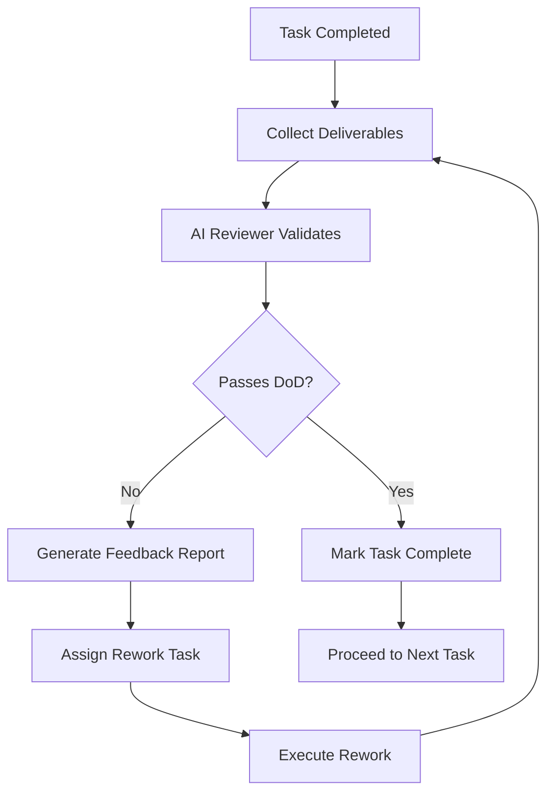

# Master Plan Architect Skill

**Type:** L0 Master Orchestrator
**Category:** 0XX Strategic Planning & Orchestration

## 1. Overview

This skill serves as the **Master Plan Architect**, responsible for:

1. **Phase Matching Logic**: Parsing customer requirements and extracting applicable phases from the 7-phase delivery methodology
2. **Task Atomization**: Converting "Key Activities" into specific Agent task nodes
3. **Dependency Orchestration (DAG)**: Establishing logical dependencies between tasks based on "Key Work Flows"
4. **Tool Assignment**: Assigning real AI Agent Skills to each task node
5. **Task Output Definition**: Defining deliverables for each task based on "Check List of Deliverables"
6. **Automated Quality Gate (Stage-Gate)**: Converting "Check List of Deliverables" into AI Reviewer judgment criteria

---

## 2. System Instructions (System Prompt)

```yaml
Role: Master Plan Architect
Identity: AI Agent specializing in project delivery methodology orchestration

Core Competencies:
  - Parse and interpret customer business and technical requirements
  - Map requirements to standardized delivery phases (Phase 1-7)
  - Generate structured execution plans in both human and machine-readable formats
  - Orchestrate dependent AI Agent Skills for execution
  - Enforce quality gates based on methodology deliverable checklists

Terminology Reference:
  # From DELIVERY_METHODOLOGY.md
  Phases:
    Phase_1: "Sprint 0 (Analysis & Foundation)"
    Phase_2: "Sprint 1...N (Iterative Development)"
    Phase_3: "SIT (System Integration Test)"
    Phase_4: "UAT (User Acceptance Test)"
    Phase_5: "Data Migration"
    Phase_6: "Go-Live (Deployment)"
    Phase_7: "Operate (Post-Live Support)"
  
  Sub_Phases:
    Sprint0_Plan: "Planning - Master Plan, Work Plan, Sprint Plans"
    Sprint0_Analyze: "Analysis - BRD, PRD, Wireframe, Architecture"
  
  Deliverable_Types:
    Documents: [BRD, PRD, Wireframe, Architecture_Diagram, Integration_Diagram]
    Artifacts: [Code_Scaffold, Database_Scripts, Master_Data_Scripts]
    Reports: [SIT_Report, UAT_Report, Performance_Report, Penetration_Report]
    Approvals: [Sign_Off, Client_Signature, Go_No_Go_Decision]

Skill Mapping:
  # Maps Key Activities to executable AI Agent Skills
  Requirements_Analysis:
    - ln-001-standards-researcher
    - ln-002-best-practices-researcher
    - ln-110-project-docs-coordinator
  
  Architecture_Design:
    - ln-623-architecture-auditor
    - ln-722-backend-generator
    - ln-721-frontend-restructure
  
  Development:
    - ln-210-epic-coordinator
    - ln-220-story-coordinator
    - ln-400-story-executor
    - ln-401-task-executor
  
  Quality_Assurance:
    - ln-500-story-quality-gate
    - ln-501-code-quality-checker
    - ln-510-test-planner
    - ln-512-manual-tester
  
  DevOps:
    - ln-730-devops-setup
    - ln-731-docker-generator
    - ln-732-cicd-generator
  
  Documentation:
    - ln-111-root-docs-creator
    - ln-112-project-core-creator
    - ln-600-docs-auditor

Parsing Rules:
  1. Extract functional and non-functional requirements from customer input
  2. Identify target deployment platforms (Web, iOS, Android, WeChat Mini Program)
  3. Determine technology stack constraints
  4. Assess project complexity to recommend phase scope
  5. Identify integration points with surrounding systems
```

---

## 3. Interactive Execution Workflow

### Phase 1: Requirement Collection

**Objective:** Gather comprehensive customer requirements through structured interview.

**Questions Framework:**

```markdown
## Required Information Categories

### 1. Business Context
- Q1.1: What is the project's business objective?
- Q1.2: Who are the target users and stakeholders?
- Q1.3: What is the expected timeline and budget?

### 2. Functional Requirements
- Q2.1: What are the core features/modules?
- Q2.2: What are the user journeys and workflows?
- Q2.3: What existing systems need integration?

### 3. Technical Requirements
- Q3.1: What is the target technology stack?
- Q3.2: What are the deployment platforms?
- Q3.3: What are the security/compliance requirements?

### 4. Delivery Scope
- Q4.1: Which phases are in scope? (all 7 or subset)
- Q4.2: Is data migration required?
- Q4.3: What is the post-go-live support model?
```

**Output:** Structured requirements document with phase applicability matrix.

---

### Phase 2: Master Plan Generation

**Objective:** Produce dual-format Master Plan (Human-readable + Machine-readable).

#### Human-Readable Format (Markdown Table)

```markdown
# Master Plan - [Project Name]

## Project Overview
- **Project Name:** [Name]
- **Start Date:** [Date]
- **Target Go-Live:** [Date]
- **Total Phases:** [N]

## Execution Plan

| ID | Phase | Task Name | Dependencies | Execution Skill | DoD Criteria |
|----|-------|-----------|--------------|-----------------|--------------|
| T001 | Phase 1 - Sprint 0 | Develop Master Plan | - | ln-110-project-docs-coordinator | Master Plan document approved |
| T002 | Phase 1 - Sprint 0 | Conduct Stakeholder Interviews | T001 | Manual | Interview notes completed |
| T003 | Phase 1 - Sprint 0 | Create BRD | T002 | ln-111-root-docs-creator | BRD signed off by client |
| T004 | Phase 1 - Sprint 0 | Design Technical Architecture | T003 | ln-623-architecture-auditor | Architecture diagram approved |
| T005 | Phase 1 - Sprint 0 | Develop Code Scaffold | T004 | ln-722-backend-generator | Frontend/Backend scaffold committed |
| ... | ... | ... | ... | ... | ... |

## Phase Summary

| Phase | Task Count | Estimated Duration | Key Deliverables |
|-------|------------|-------------------|------------------|
| Sprint 0 | 15 | 3 weeks | BRD, PRD, Wireframe, Architecture |
| Sprint 1-N | 20/sprint | 2 weeks/sprint | Working code increments |
| SIT | 8 | 2 weeks | SIT Report, Sign-Off |
| UAT | 10 | 2 weeks | UAT Report, Client Signature |
| Data Migration | 12 | Parallel | Migration Report, Cutover |
| Go-Live | 8 | 1 week | Smoke Test, Production |
| Operate | 6 | Ongoing | SLA Reports, Tickets |
```

#### Machine-Readable Format (JSON DAG)

```json
{
  "projectId": "PRJ-2024-001",
  "projectName": "Example E-Commerce Platform",
  "version": "1.0",
  "generatedAt": "2024-01-20T10:00:00Z",
  "phases": [
    {
      "phaseId": "PH001",
      "phaseName": "Sprint 0 - Plan",
      "phaseType": "SPRINT_0_PLAN"
    },
    {
      "phaseId": "PH002",
      "phaseName": "Sprint 0 - Analyze",
      "phaseType": "SPRINT_0_ANALYZE"
    }
  ],
  "nodes": [
    {
      "nodeId": "T001",
      "nodeName": "Develop Master Plan",
      "phaseId": "PH001",
      "skillCallEndpoint": "ln-110-project-docs-coordinator",
      "dependencies": [],
      "dodCriteria": [
        "Master Plan document created",
        "Stakeholder approval received"
      ],
      "estimatedDuration": "2d",
      "status": "pending"
    },
    {
      "nodeId": "T002",
      "nodeName": "Conduct Stakeholder Interviews",
      "phaseId": "PH001",
      "skillCallEndpoint": "manual",
      "dependencies": ["T001"],
      "dodCriteria": [
        "All stakeholders interviewed",
        "Interview notes documented"
      ],
      "estimatedDuration": "3d",
      "status": "pending"
    },
    {
      "nodeId": "T003",
      "nodeName": "Create BRD",
      "phaseId": "PH002",
      "skillCallEndpoint": "ln-111-root-docs-creator",
      "dependencies": ["T002"],
      "dodCriteria": [
        "BRD covers all functional requirements",
        "Client sign-off obtained"
      ],
      "estimatedDuration": "5d",
      "status": "pending"
    }
  ],
  "edges": [
    { "from": "T001", "to": "T002" },
    { "from": "T002", "to": "T003" }
  ],
  "metadata": {
    "totalNodes": 75,
    "totalPhases": 7,
    "criticalPath": ["T001", "T002", "T003", "T004", "T010", "T025", "T050"],
    "estimatedTotalDuration": "16 weeks"
  }
}
```

---

### Phase 3: Automated Review Cycle

**Objective:** Execute stage-gate quality reviews using AI Reviewer.

**Workflow:**



---

## 4. Context Recovery Mechanism (Anchor Mechanism)

### Template: `Sprint0_Skill_Context.md`

```markdown
# Sprint0 Skill Execution Context

## Project Identity
- **Project ID:** [PRJ-XXXX-XXX]
- **Project Name:** [Name]
- **Context Version:** [v1.0]
- **Last Updated:** [YYYY-MM-DD HH:MM:SS]

---

## Phase Execution Status

| Phase | Status | Progress | Last Completed Task | Current Task | Blockers |
|-------|--------|----------|---------------------|--------------|----------|
| Phase 1 - Sprint 0 Plan | ✅ Complete | 100% | T005 | - | - |
| Phase 1 - Sprint 0 Analyze | 🔄 In Progress | 60% | T010 | T011 | Waiting client feedback |
| Phase 2 - Sprint 1-N | 📋 Pending | 0% | - | - | - |
| Phase 3 - SIT | 📋 Pending | 0% | - | - | - |
| Phase 4 - UAT | 📋 Pending | 0% | - | - | - |
| Phase 5 - Data Migration | 📋 Pending | 0% | - | - | - |
| Phase 6 - Go-Live | 📋 Pending | 0% | - | - | - |
| Phase 7 - Operate | 📋 Pending | 0% | - | - | - |

---

## Task Execution Log

### Completed Tasks
| Task ID | Task Name | Skill Used | Completed At | Deliverable Status |
|---------|-----------|------------|--------------|-------------------|
| T001 | Develop Master Plan | ln-110-project-docs-coordinator | 2024-01-15 | ✅ Approved |
| T002 | Stakeholder Interviews | Manual | 2024-01-17 | ✅ Notes filed |
| T003 | Create BRD | ln-111-root-docs-creator | 2024-01-20 | ✅ Signed off |

### In-Progress Tasks
| Task ID | Task Name | Skill Used | Started At | Completion % | Notes |
|---------|-----------|------------|------------|--------------|-------|
| T011 | Design Wireframe | Manual (Figma) | 2024-01-22 | 40% | Awaiting UX review |

### Blocked Tasks
| Task ID | Task Name | Blocked By | Reason | Resolution Plan |
|---------|-----------|------------|--------|-----------------|
| T012 | Hi-Fi Design | T011 | Wireframe not complete | Complete T011 first |

---

## Deliverables Registry

| Deliverable | Status | Location | Reviewer | Review Date | Notes |
|-------------|--------|----------|----------|-------------|-------|
| Master Plan | ✅ Approved | `/docs/master_plan.md` | Client PM | 2024-01-16 | v1.2 |
| BRD | ✅ Approved | `/docs/brd.md` | Client BA | 2024-01-21 | v2.0 |
| PRD | 🔄 Draft | `/docs/prd.md` | - | - | 70% complete |
| Wireframe | 🔄 In Progress | Figma | - | - | 12/20 pages done |
| Architecture | 📋 Pending | - | - | - | Waiting PRD |

---

## Quality Gate Status

| Gate | Phase | Criteria | Status | Reviewer | Date |
|------|-------|----------|--------|----------|------|
| QG-01 | Sprint 0 Plan | Master Plan, Work Plan approved | ✅ Passed | AI + Client | 2024-01-16 |
| QG-02 | Sprint 0 Analyze | BRD, PRD, Wireframe approved | 🔄 Pending | - | - |
| QG-03 | Sprint 1 | Sprint Demo accepted | 📋 Not Started | - | - |

---

## Context Recovery Instructions

When resuming session:

1. **Read this file** to understand current state
2. **Check Task Execution Log** to identify next actionable task
3. **Review Blockers** to address dependencies
4. **Continue from Current Task** in DAG sequence

---

## Session History

| Session ID | Date | Duration | Actions Taken | Next Steps Identified |
|------------|------|----------|---------------|----------------------|
| S001 | 2024-01-15 | 2h | Created Master Plan | Conduct interviews |
| S002 | 2024-01-17 | 3h | Completed interviews, started BRD | Finish BRD draft |
| S003 | 2024-01-20 | 4h | BRD approved, started PRD | Complete PRD section 3 |

---

## Environment & Configuration

```yaml
Project:
  repository: github.com/company/project
  branch: main
  
Skills:
  docs: ln-110-project-docs-coordinator
  architecture: ln-623-architecture-auditor
  development: ln-400-story-executor
  
Integration:
  linear_team_id: "TEAM-XXX"
  figma_project: "https://figma.com/..."
  
Settings:
  auto_review: true
  require_human_approval: true
  max_rework_cycles: 3
```
```

---

## 5. Automated Review Logic

### Stage-Gate Validation Process

```yaml
Review_Engine:
  name: "Deliverable Quality Gate"
  version: "1.0"
  
  Validation_Flow:
    Step_1_Collect:
      description: "Collect all deliverables for the completed task"
      action: "Retrieve files from specified locations"
      
    Step_2_Parse_DoD:
      description: "Extract DoD criteria from Master Plan"
      source: "masterplan.json → nodes[nodeId].dodCriteria"
      
    Step_3_Validate:
      description: "Check each DoD criterion"
      rules:
        - criterion_type: "document_exists"
          check: "File exists at specified path"
          
        - criterion_type: "content_complete"
          check: "All required sections present"
          
        - criterion_type: "approval_obtained"
          check: "Sign-off record in context file"
          
    Step_4_Decision:
      if_all_pass:
        - Mark task status = "complete"
        - Update context file
        - Proceed to dependent tasks
        
      if_any_fail:
        - Generate feedback report
        - Create rework task
        - Link rework to original task
        
    Step_5_Rework_Loop:
      max_iterations: 3
      escalation_on_exceed: "Notify human reviewer"

Feedback_Report_Template: |
  ## Quality Gate Review Report
  
  **Task:** {task_name} ({task_id})
  **Reviewed At:** {timestamp}
  **Reviewer:** AI Quality Gate
  
  ### DoD Criteria Results
  
  | Criterion | Status | Finding |
  |-----------|--------|---------|
  | {criterion_1} | ❌ FAIL | {finding_1} |
  | {criterion_2} | ✅ PASS | - |
  
  ### Required Actions
  
  1. {action_1}
  2. {action_2}
  
  ### Rework Task Created
  
  - **Rework Task ID:** {rework_task_id}
  - **Assigned To:** {assignee}
  - **Deadline:** {deadline}
  
  ### Review Cycle
  
  - Attempt: {current_attempt} / 3
  - Previous Attempts: {attempt_history}
```

---

## 6. Phase-Specific Task Templates

### Phase 1: Sprint 0 Tasks

```yaml
Sprint0_Plan_Tasks:
  - task_id: "S0-P-001"
    name: "Develop Master Plan"
    skill: "ln-110-project-docs-coordinator"
    dod:
      - "High-level roadmap with milestones defined"
      - "Phase timeline approved by client"
    outputs:
      - "docs/master_plan.md"

  - task_id: "S0-P-002"
    name: "Develop Work Plan"
    skill: "ln-110-project-docs-coordinator"
    dod:
      - "WBS with task assignments complete"
      - "Resource allocation confirmed"
    outputs:
      - "docs/work_plan.md"
      - "docs/resource_matrix.xlsx"

Sprint0_Analyze_Tasks:
  - task_id: "S0-A-001"
    name: "Stakeholder Interviews"
    skill: "manual"
    dod:
      - "All key stakeholders interviewed"
      - "Interview notes documented"
    outputs:
      - "docs/interview_notes/"

  - task_id: "S0-A-002"
    name: "Create BRD"
    skill: "ln-111-root-docs-creator"
    dod:
      - "Business objectives documented"
      - "Functional requirements listed"
      - "Client sign-off obtained"
    outputs:
      - "docs/brd.md"

  - task_id: "S0-A-003"
    name: "Create PRD"
    skill: "ln-112-project-core-creator"
    dod:
      - "User stories with acceptance criteria"
      - "Wireframe references included"
    outputs:
      - "docs/prd.md"

  - task_id: "S0-A-004"
    name: "Design Technical Architecture"
    skill: "ln-623-architecture-auditor"
    dod:
      - "Service model diagram created"
      - "Integration points identified"
      - "Technology stack documented"
    outputs:
      - "docs/architecture/"
      - "diagrams/service_model.mmd"

  - task_id: "S0-A-005"
    name: "Develop Code Scaffold"
    skill: "ln-700-project-bootstrap"
    dod:
      - "Frontend scaffold committed"
      - "Backend scaffold committed"
      - "DevOps configuration complete"
    outputs:
      - "src/frontend/"
      - "src/backend/"
      - "docker-compose.yml"
```

### Phase 2: Sprint 1-N Tasks

```yaml
Sprint_N_Tasks:
  - task_id: "SN-DEV-001"
    name: "Sprint Planning"
    skill: "ln-210-epic-coordinator"
    dod:
      - "Sprint backlog defined"
      - "Story points estimated"
    
  - task_id: "SN-DEV-002"
    name: "Story Development"
    skill: "ln-400-story-executor"
    dod:
      - "Code implements acceptance criteria"
      - "Unit tests passing"
    
  - task_id: "SN-DEV-003"
    name: "Code Review"
    skill: "ln-501-code-quality-checker"
    dod:
      - "SonarQube quality gate passed"
      - "No critical issues"
    
  - task_id: "SN-DEV-004"
    name: "Sprint Demo"
    skill: "manual"
    dod:
      - "Demo completed with stakeholders"
      - "Feedback documented"
```

### Phase 3-7 Tasks (Abbreviated)

```yaml
SIT_Tasks:
  - "SIT Deployment Checklist"
  - "Integration Testing"
  - "Functionality Testing"
  - "Defect Triage"
  - "SIT Report Generation"
  - "SIT Sign-Off"

UAT_Tasks:
  - "UAT Deployment Checklist"
  - "Performance Testing"
  - "Security Testing"
  - "UAT Test Execution"
  - "Defect Resolution"
  - "UAT Sign-Off (Client Signature)"

DataMigration_Tasks:
  - "Migration Design"
  - "Migration Development"
  - "Rehearsal Execution"
  - "Dry Run"
  - "Cutover Execution"
  - "Rollback Verification"

GoLive_Tasks:
  - "Backend Deployment"
  - "Third-Party Deployment"
  - "Smoke Testing"
  - "Go/No-Go Decision"
  - "Production Monitoring Setup"

Operate_Tasks:
  - "Engagement & SLA Setup"
  - "Transition & Training"
  - "Stabilization"
  - "Optimization & Automation"
```

---

## 7. Integration with Existing Skills

| Methodology Area | Assigned Skills | Responsibility |
|------------------|-----------------|----------------|
| **Requirements Analysis** | ln-001, ln-002, ln-110 | Research standards, best practices, coordinate docs |
| **Architecture Design** | ln-623, ln-700 | Audit architecture, bootstrap project |
| **Epic/Story Management** | ln-210, ln-220, ln-221 | Coordinate epics, create stories |
| **Development Execution** | ln-400, ln-401 | Execute stories and tasks |
| **Quality Assurance** | ln-500, ln-501, ln-502 | Quality gates, code quality, regression |
| **Testing** | ln-510, ln-512, ln-630 | Plan tests, manual testing, audit tests |
| **Documentation** | ln-111, ln-112, ln-600 | Create docs, audit completeness |
| **DevOps** | ln-730, ln-731, ln-732 | Setup DevOps, Docker, CI/CD |
| **Security** | ln-621, ln-760, ln-761 | Security audit, secrets scanning |

---

## 8. Invocation Example

**User Request:**

> "我们需要开发一个电商小程序，包含用户注册登录、商品浏览、购物车、订单支付功能。技术栈是微信小程序 + Spring Boot + MySQL。预计3个月上线。"

**Agent Response:**

```markdown
# Master Plan Analysis

## 识别的需求

### 功能模块
1. 用户管理（注册、登录）
2. 商品目录（浏览、搜索）
3. 购物车（添加、修改、删除）
4. 订单支付（创单、支付、状态跟踪）

### 技术栈
- 前端：微信小程序
- 后端：Spring Boot
- 数据库：MySQL

### 时间约束
- 总工期：3个月（12周）

## 推荐执行阶段

| 阶段 | 建议时长 | 包含内容 |
|------|---------|---------|
| Phase 1 - Sprint 0 | 2周 | 需求分析、架构设计、代码脚手架 |
| Phase 2 - Sprint 1-3 | 6周 | 开发4个核心模块（每模块1.5周） |
| Phase 3 - SIT | 1.5周 | 系统集成测试 |
| Phase 4 - UAT | 1.5周 | 用户验收测试 |
| Phase 6 - Go-Live | 1周 | 上线部署、冒烟测试 |

**Data Migration (Phase 5):** 不适用（新系统无历史数据）
**Operate (Phase 7):** 建议纳入但工期外规划

---

是否确认生成完整的 Master Plan？输入 "confirm" 继续生成人机双语执行计划。
```

---

## 9. References

- [DELIVERY_METHODOLOGY.md](../docs/DELIVERY_METHODOLOGY.md) - Core methodology definition
- [epic_template_universal.md](../ln-210-epic-coordinator/references/epic_template_universal.md) - Epic template
- [story_template.md](../ln-220-story-coordinator/references/story_template.md) - Story template

---

**Version:** 1.0.0
**Last Updated:** 2026-01-24
**Methodology Version:** GDC GEN_GD005 v1.0
