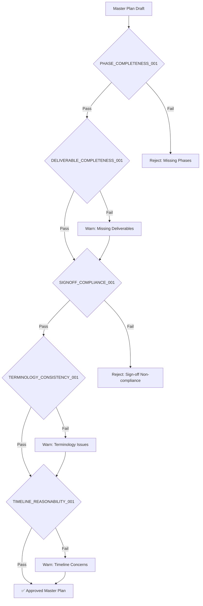

# Sprint 0 Skill Context Document

> 📌 **上下文锚点文档**：本文档汇总了开发 Sprint 0 Master Plan Generator Skill 所需的全部上下文信息，确保 AI Agent 在执行时能够准确对标方法论。

---

## 1. 方法论核心引用

### 1.1 Hybrid Agile 方法论定义

```yaml
Source: DELIVERY_METHODOLOGY.md
Key_Reference:
  - Line 3-5: Overall Methodology Definition
  - Line 8-11: Delivery Process Components
  - Line 13-20: Delivery Process Flow Diagram
```

**核心声明：**
> "This methodology drives speed, flexibility, and transparency. The delivery methodology complies with EVD (Enterprise Value Delivery) method."

---

### 1.2 七阶段结构 (7-Phase Structure)

| Phase | Name | Focus | Source |
|-------|------|-------|--------|
| 1/7 | **Sprint 0** | Analysis & Foundation | Line 38 |
| 2/7 | **Sprint 1...N** | Iterative Development | Line 145 |
| 3/7 | **SIT** | System Integration Test | Line 219 |
| 4/7 | **UAT** | User Acceptance Test | Line 274 |
| 5/7 | **Data Migration** | Parallel Waterfall Thread | Line 347 |
| 6/7 | **Go-Live** | Deployment | Line 436 |
| 7/7 | **Operate** | Post-Live Support | Line 510 |

---

### 1.3 Sprint 0 双子阶段定义

```yaml
Source: Line 40-48
Structure:
  Plan_Phase:
    Focus: "Project setup, foundation establishment"
    Key_Outputs:
      - Master Plan
      - Work Plan
      - Sprint Plans
  Analyze_Phase:
    Focus: "Requirements analysis, architecture design"
    Key_Outputs:
      - BRD
      - PRD
      - Wireframe
      - Architecture Diagrams
```

---

## 2. 质量审计机制 (Quality Audit Mechanism)

### 2.1 审计检查清单 (Audit Checklist)

#### 2.1.1 阶段完整性检查 (Phase Completeness)

```yaml
Audit_Rule: PHASE_COMPLETENESS_001
Description: "验证生成的 Master Plan 是否覆盖全部 7 个阶段"
Check_Points:
  - [ ] Phase 1: Sprint 0 is present with Plan and Analyze sub-phases
  - [ ] Phase 2: Sprint 1...N development cycles defined
  - [ ] Phase 3: SIT phase included
  - [ ] Phase 4: UAT phase included
  - [ ] Phase 5: Data Migration as parallel waterfall thread
  - [ ] Phase 6: Go-Live deployment phase included
  - [ ] Phase 7: Operate support phase included
Severity: CRITICAL
Failure_Action: "Reject plan and request regeneration"
```

---

#### 2.1.2 交付物完整性检查 (Deliverable Completeness)

```yaml
Audit_Rule: DELIVERABLE_COMPLETENESS_001
Description: "验证 Sprint 0 所有必须交付物是否被包含"

Plan_Phase_Required_Deliverables:
  - name: "Master Plan"
    mandatory: true
    source: "Line 118"
  - name: "Work Plan"
    mandatory: true
    source: "Line 119"
  - name: "Sprint Plans"
    mandatory: true
    source: "Line 120"
  - name: "Project Org Chart"
    mandatory: true
    source: "Line 121"
  - name: "Contact List"
    mandatory: true
    source: "Line 122"

Analyze_Phase_Required_Deliverables:
  - name: "Business Requirement Document (BRD)"
    mandatory: true
    source: "Line 127"
  - name: "Product Requirement Document (PRD)"
    mandatory: true
    source: "Line 128"
  - name: "Wireframe"
    mandatory: true
    source: "Line 129"
  - name: "Service Model Diagram"
    mandatory: true
    source: "Line 130"
  - name: "Technical Architecture Diagram"
    mandatory: true
    source: "Line 131"
  - name: "Integration Architecture Diagram"
    mandatory: true
    source: "Line 132"
  - name: "Frontend Code Scaffold"
    mandatory: true
    source: "Line 133"
  - name: "Backend Code Scaffold"
    mandatory: true
    source: "Line 134"
  - name: "DevOps Account List"
    mandatory: true
    source: "Line 135"
  - name: "Functionalities and Assignments List"
    mandatory: true
    source: "Line 136"
  - name: "Master Data Scripts"
    mandatory: true
    source: "Line 137"
  - name: "Database Design Scripts"
    mandatory: true
    source: "Line 138"
  - name: "IaaS and PaaS Request List"
    mandatory: true
    source: "Line 139"
  - name: "3rd Party Account Request List"
    mandatory: true
    source: "Line 140"
  - name: "UI/UX Hi-Fi Pages"
    mandatory: true
    source: "Line 141"

Severity: HIGH
Failure_Action: "Flag missing deliverables and prompt for inclusion"
```

---

#### 2.1.3 Sign-off 合规性检查 (Sign-off Compliance)

```yaml
Audit_Rule: SIGNOFF_COMPLIANCE_001
Description: "验证所有需要客户签字的交付物是否被正确标注"
Source: "Line 609, 611-621"

Mandatory_Statement: |
  "All Deliverables Of Requirements, UX/UI Design And Architecture 
   Must Be Signed-off With Your Client."

Sprint0_Signoff_Required:
  - BRD
  - PRD
  - Wireframe
  - Architecture Diagrams

All_Phases_Signoff_Matrix:
  Sprint_0:
    - BRD
    - PRD
    - Wireframe
    - Architecture Diagrams
  Sprint_1_N:
    - Updated Requirements
    - Integration Interfaces
  SIT:
    - SIT Report
    - SIT Test Results
  UAT:
    - UAT Report (Client signature mandatory)
  Data_Migration:
    - Migration Runbook
    - Cutover Report
  Go_Live:
    - Smoke Testing Report
    - Go/No-Go Decision
  Operate:
    - Service Catalog
    - SLA Agreement

Severity: CRITICAL
Failure_Action: "Reject plan without proper sign-off markers"
```

---

#### 2.1.4 术语一致性检查 (Terminology Consistency)

```yaml
Audit_Rule: TERMINOLOGY_CONSISTENCY_001
Description: "验证使用的术语是否与方法论一致"

Required_Terminology:
  - term: "Hybrid Agile"
    context: "Overall methodology name"
    source: "Line 3"
    
  - term: "EVD (Enterprise Value Delivery)"
    context: "Compliance framework"
    source: "Line 5"
    
  - term: "Sprint 0"
    context: "Analysis & Foundation phase"
    source: "Line 8, 38"
    alternative: "Phase 1/7"
    
  - term: "Waterfall Thread"
    context: "Data Migration parallel execution"
    source: "Line 11"
    
  - term: "DoD (Definition of Done)"
    context: "Deliverable checklist"
    source: "Line 115"
    
  - term: "MIC (Manager in Charge)"
    context: "Project management role"
    source: "Line 26"
    
  - term: "PIC (Partner in Charge)"
    context: "Schedule management role"
    source: "Line 27"
    
  - term: "2-week Sprint"
    context: "Recommended sprint duration"
    source: "Line 172"

Severity: MEDIUM
Failure_Action: "Suggest terminology corrections"
```

---

#### 2.1.5 时间线合理性检查 (Timeline Reasonability)

```yaml
Audit_Rule: TIMELINE_REASONABILITY_001
Description: "验证时间线是否符合方法论建议"

Sprint_Duration_Rule:
  recommended: "2 weeks"
  source: "Line 172"
  tolerance: "± 1 week"
  
Phase_Sequence_Rule:
  - Sprint_0 MUST precede Sprint_1_N
  - All Dev Sprints MUST complete before SIT
  - SIT MUST complete before UAT
  - UAT Sign-off MUST precede Go-Live
  - Data Migration CAN run in parallel
  
Minimum_Phase_Durations:
  Sprint_0: "2-4 weeks"
  Each_Sprint: "2 weeks"
  SIT: "1-2 weeks"
  UAT: "1-2 weeks"
  Go_Live: "3-5 days"

Severity: MEDIUM
Failure_Action: "Warn about timeline deviations"
```

---

### 2.2 审计执行流程



---

### 2.3 审计结果等级

| 等级 | 描述 | 处理方式 |
|------|------|----------|
| ✅ **PASS** | 完全符合方法论 | 直接输出 |
| ⚠️ **WARN** | 存在次要偏差 | 输出并附带警告 |
| ❌ **REJECT** | 存在关键缺失 | 拒绝输出，返回修正 |

---

## 3. 角色职责映射

### 3.1 Sprint 0 角色矩阵

```yaml
Source: "Lines 24-34"

Roles:
  MIC:
    full_name: "Manager in Charge"
    sprint0_responsibilities:
      - Overall project management
      - Resource allocation
      - Management review
      - Resolve key issues
      
  PIC:
    full_name: "Partner in Charge"
    sprint0_responsibilities:
      - Schedule management
      - Risk tracking
      - Quality improvement activities
      
  Consulting_BA:
    full_name: "Consulting Business Analyst"
    sprint0_responsibilities:
      - Business requirement development
      - Stakeholder interviews
      - BRD development
      
  System_BA:
    full_name: "System Business Analyst"
    sprint0_responsibilities:
      - PRD development
      - Prototype/wireframe
      - User stories with acceptance criteria
      
  Architecture_Team:
    sprint0_responsibilities:
      - Tech stack definition
      - Service design
      - Data design
      - Network design
      - Integration design
      - Security design
      
  UX_Designer:
    sprint0_responsibilities:
      - User experience design
      - Communication/interaction/journey/relationship layers
      
  UI_Designer:
    sprint0_responsibilities:
      - UI page design based on wireframe
      - Visual compliance review
```

---

## 4. 工作流引用

### 4.1 Plan Phase 工作流

```yaml
Source: "Lines 89-97"
Flow:
  1. Plan Project
  2. Setup Foundation
  3. Develop Master Plan
  4. Develop Work Plan
  5. Develop Sprint Plans
```

### 4.2 Analyze Phase 工作流

```yaml
Source: "Lines 100-113"
Flow:
  1. Analyze Requirements
  2. Split to User Stories
  3. Backlog Requirements
  4. Design High Level Test Cases
  5. Check Points
  6. Design Documents & Code Scaffold (parallel)
  7. Design UX/UI (parallel)
  8. Wireframe
  9. Split to HTML Code
  10. Hi-Fi Pages
```

---

## 5. 输入参数规范

### 5.1 必填参数

```yaml
Required_Inputs:
  project_name:
    type: string
    description: "项目名称"
    example: "E-Commerce Platform v2.0"
    
  project_description:
    type: string
    description: "项目背景和业务描述"
    max_length: 2000
    
  business_domain:
    type: enum
    values:
      - e_commerce
      - finance
      - healthcare
      - manufacturing
      - government
      - education
      - other
    description: "业务领域"
    
  tech_stack:
    type: object
    properties:
      frontend:
        type: string
        example: "React/Vue/Flutter"
      backend:
        type: string
        example: "Spring Boot/Node.js/.NET"
      database:
        type: string
        example: "MySQL/PostgreSQL/MongoDB"
      cloud:
        type: string
        example: "AWS/Azure/GCP/Private"
        
  estimated_sprints:
    type: integer
    min: 1
    max: 20
    description: "预估开发 Sprint 数量"
    
  start_date:
    type: date
    format: "YYYY-MM-DD"
    description: "项目启动日期"
```

### 5.2 可选参数

```yaml
Optional_Inputs:
  team_structure:
    type: object
    properties:
      total_headcount:
        type: integer
      roles:
        type: array
        items:
          role: string
          count: integer
          
  constraints:
    type: array
    items:
      type: string
    description: "特殊约束条件列表"
    
  third_party_integrations:
    type: array
    items:
      name: string
      type: enum[api, sdk, service]
      priority: enum[high, medium, low]
      
  deployment_targets:
    type: array
    values:
      - ios_appstore
      - android_googleplay
      - android_huawei
      - android_xiaomi
      - wechat_miniprogram
      - web_application
      - other
```

---

## 6. 输出结构规范

### 6.1 Master Plan 输出模板

```yaml
Output_Structure:
  header:
    project_name: string
    version: string
    created_date: date
    methodology: "Hybrid Agile (EVD Compliant)"
    
  executive_summary:
    project_overview: string
    key_objectives: array
    success_criteria: array
    
  phase_breakdown:
    - phase_id: "1/7"
      phase_name: "Sprint 0"
      sub_phases:
        - name: "Plan"
          duration: string
          deliverables: array
          signoff_required: array
        - name: "Analyze"
          duration: string
          deliverables: array
          signoff_required: array
    # ... phases 2-7
    
  timeline:
    gantt_chart: mermaid_diagram
    milestones: array
    
  team_structure:
    org_chart: mermaid_diagram
    roles_responsibilities: table
    
  deliverable_checklist:
    by_phase: array
    with_signoff_markers: boolean
    
  risk_register:
    identified_risks: array
    mitigation_strategies: array
    
  appendix:
    terminology_glossary: table
    signoff_matrix: table
```

---

## 7. 版本与更新记录

| Version | Date | Changes |
|---------|------|---------|
| 1.0 | 2026-01-24 | Initial context document |

---

> 📌 **本文档应作为 Sprint 0 Master Plan Generator Skill 的核心上下文锚点，确保生成结果与 DELIVERY_METHODOLOGY.md 保持一致。**
