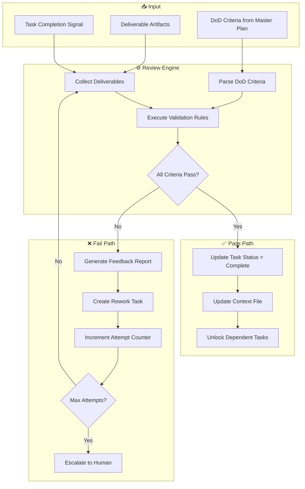

# Automated Review Logic

> 此文件定义了 AI Reviewer 根据方法论 Check List 进行 "不通过→反馈→重做" 闭环操作的详细逻辑。

---

## 1. Overview

The Automated Review System implements Stage-Gate quality control based on the "Check List of Deliverables" from `DELIVERY_METHODOLOGY.md`. It ensures:

1. **Compliance**: All deliverables meet defined DoD (Definition of Done) criteria
2. **Traceability**: Review decisions are logged and auditable
3. **Iteration**: Failed reviews trigger rework loops with actionable feedback
4. **Escalation**: Repeated failures escalate to human reviewers

---

## 2. Review Engine Architecture



---

## 3. DoD Criteria Types

### 3.1 Document Existence Check

```yaml
criteria_type: document_exists
description: "Verify that a required document exists at the specified path"

validation_logic:
  - action: "Check file system for document"
  - check: "file_exists(path)"
  - fallback: "Check alternative locations"
  
example:
  criterion: "BRD document created"
  expected_path: "docs/requirements/brd.md"
  validation:
    - Check: "File exists at docs/requirements/brd.md"
    - Pass: "Document found"
    - Fail: "Document not found at expected location"
```

### 3.2 Content Completeness Check

```yaml
criteria_type: content_complete
description: "Verify that a document contains all required sections"

validation_logic:
  - action: "Parse document structure"
  - check: "All required sections present"
  - check: "Section content is non-empty"
  
example:
  criterion: "BRD covers all functional requirements"
  required_sections:
    - "Business Objectives"
    - "Functional Requirements"
    - "Non-Functional Requirements"
    - "Constraints and Assumptions"
  validation:
    - Check: "Parse markdown headings"
    - Pass: "All 4 required sections found with content"
    - Fail: "Missing sections: [list]"
```

### 3.3 Approval/Sign-off Check

```yaml
criteria_type: approval_obtained
description: "Verify that formal approval has been recorded"

validation_logic:
  - action: "Check context file for approval record"
  - check: "Approval entry exists with valid timestamp"
  - check: "Approver identity recorded"
  
example:
  criterion: "Client sign-off obtained"
  approval_sources:
    - "Sprint0_Skill_Context.md → Quality Gate Status"
    - "Approval log entry"
    - "Email confirmation reference"
  validation:
    - Check: "QG-02 status = Passed in context file"
    - Pass: "Sign-off recorded on [date] by [approver]"
    - Fail: "No approval record found"
```

### 3.4 Code Quality Check

```yaml
criteria_type: code_quality
description: "Verify code meets quality standards"

validation_logic:
  - action: "Run code quality tools"
  - check: "SonarQube quality gate passed"
  - check: "No critical issues"
  - check: "Test coverage >= threshold"
  
example:
  criterion: "Code review completed with no critical issues"
  quality_gates:
    - "Code coverage >= 80%"
    - "No critical/blocker issues"
    - "Duplications < 5%"
  validation:
    - Check: "Query SonarQube API for project status"
    - Pass: "All quality gates passed"
    - Fail: "Quality gate failed: [details]"
```

### 3.5 Test Execution Check

```yaml
criteria_type: test_execution
description: "Verify tests were executed and passed"

validation_logic:
  - action: "Check test execution reports"
  - check: "All tests executed"
  - check: "Pass rate meets threshold"
  
example:
  criterion: "All test cases executed with >= 95% pass rate"
  test_sources:
    - "Jest/JUnit test reports"
    - "Test management tool exports"
  validation:
    - Check: "Parse test results XML/JSON"
    - Pass: "150/150 tests passed (100%)"
    - Fail: "142/150 tests passed (94.67%) - below threshold"
```

### 3.6 Integration Check

```yaml
criteria_type: integration_verified
description: "Verify integration points are working"

validation_logic:
  - action: "Execute integration tests"
  - check: "All endpoints responding"
  - check: "Data flow verified"
  
example:
  criterion: "All integration interfaces tested"
  integration_points:
    - "Payment Gateway API"
    - "SMS Service"
    - "WeChat Open Platform"
  validation:
    - Check: "Run integration test suite"
    - Pass: "All 3 integration points verified"
    - Fail: "Payment Gateway: Connection timeout"
```

---

## 4. Review Execution Process

### Step 1: Trigger Review

```yaml
trigger_conditions:
  - "Task status changed to 'pending_review'"
  - "Manual review request from user"
  - "Scheduled review (end of phase)"

input_collection:
  task_id: "From trigger event"
  deliverables: "From task output definition"
  dod_criteria: "From Master Plan DAG node"
```

### Step 2: Collect Deliverables

```yaml
collection_process:
  1_locate_outputs:
    - "Read task definition from Master Plan"
    - "Extract expected output paths"
    - "Verify file/artifact locations"
    
  2_gather_artifacts:
    - "Collect all output files"
    - "Extract metadata (size, modified date)"
    - "Calculate checksums for tracking"
    
  3_prepare_context:
    - "Load task context from Sprint0_Skill_Context.md"
    - "Load previous review attempts"
    - "Prepare review session data"
```

### Step 3: Execute Validation

```yaml
validation_process:
  for_each_criterion:
    1_parse:
      - "Extract criterion text"
      - "Map to criterion type"
      - "Load validation rules"
      
    2_execute:
      - "Run validation logic"
      - "Capture results"
      - "Record evidence"
      
    3_evaluate:
      - "Compare result to expected"
      - "Mark as PASS or FAIL"
      - "Record reason"

validation_result:
  status: "PASS | FAIL"
  criteria_results:
    - criterion: "BRD document exists"
      status: "PASS"
      evidence: "File found at docs/requirements/brd.md (15KB)"
    - criterion: "Client sign-off obtained"
      status: "FAIL"
      evidence: "No approval record in context file"
  overall_pass: false
  blocking_failures: ["Client sign-off not obtained"]
```

### Step 4: Decision Branch

```yaml
if_all_pass:
  actions:
    1_update_task:
      - "Set task status = 'complete'"
      - "Record completion timestamp"
    2_update_context:
      - "Update Sprint0_Skill_Context.md"
      - "Move task from In-Progress to Completed"
    3_unlock_dependencies:
      - "Identify dependent tasks"
      - "Move to 'ready' status"
    4_notify:
      - "Log success message"
      - "Update quality gate if applicable"

if_any_fail:
  actions:
    1_generate_feedback:
      - "Create detailed feedback report"
      - "List all failing criteria"
      - "Provide actionable remediation steps"
    2_create_rework:
      - "Create rework task linked to original"
      - "Copy failing criteria as requirements"
      - "Set priority based on blocker status"
    3_check_attempts:
      - "Increment attempt counter"
      - "Check against max attempts (default: 3)"
    4_escalate_if_needed:
      - "If max attempts exceeded, escalate to human"
      - "Otherwise, queue rework task"
```

---

## 5. Feedback Report Template

```markdown
# Quality Gate Review Report

## Review Metadata
| Field | Value |
|-------|-------|
| **Review ID** | RVW-{timestamp} |
| **Task ID** | {task_id} |
| **Task Name** | {task_name} |
| **Phase** | {phase} |
| **Reviewed At** | {timestamp} |
| **Reviewer** | AI Quality Gate v1.0 |
| **Attempt** | {current_attempt} / {max_attempts} |

---

## Review Summary

| Metric | Value |
|--------|-------|
| **Total Criteria** | {total} |
| **Passed** | {passed} |
| **Failed** | {failed} |
| **Pass Rate** | {pass_rate}% |
| **Overall Status** | {PASS/FAIL} |

---

## Criterion Results

### ✅ Passed Criteria

| # | Criterion | Evidence |
|---|-----------|----------|
| 1 | {criterion_1} | {evidence_1} |
| 2 | {criterion_2} | {evidence_2} |

### ❌ Failed Criteria

| # | Criterion | Finding | Impact |
|---|-----------|---------|--------|
| 1 | {criterion_3} | {finding_3} | {impact_3} |
| 2 | {criterion_4} | {finding_4} | {impact_4} |

---

## Required Actions

> Complete these actions to pass the review:

### Action 1: {action_title_1}
- **Related Criterion:** {criterion_3}
- **Finding:** {detailed_finding}
- **Remediation Steps:**
  1. {step_1}
  2. {step_2}
  3. {step_3}
- **Assigned To:** {assignee}
- **Deadline:** {deadline}

### Action 2: {action_title_2}
- **Related Criterion:** {criterion_4}
- ...

---

## Rework Task Created

| Field | Value |
|-------|-------|
| **Rework Task ID** | {rework_task_id} |
| **Linked To** | {original_task_id} |
| **Priority** | {priority} |
| **Assigned To** | {assignee} |
| **Due Date** | {due_date} |

---

## Review History

| Attempt | Date | Status | Primary Failure |
|---------|------|--------|-----------------|
| 1 | {date_1} | FAIL | {failure_1} |
| 2 | {date_2} | FAIL | {failure_2} |
| 3 | Current | FAIL | {current_failures} |

---

## Next Steps

- [ ] Complete rework task {rework_task_id}
- [ ] Request re-review when complete
- [ ] If blocked, escalate to {escalation_contact}

---

*Review generated by AI Quality Gate System*
*Report ID: RVW-{timestamp}*
```

---

## 6. Rework Loop Management

### Rework Task Creation

```yaml
rework_task_template:
  id: "{original_task_id}-RW-{attempt}"
  name: "Rework: {original_task_name}"
  type: "rework"
  linked_task: "{original_task_id}"
  
  description: |
    Rework task created due to failed quality gate review.
    
    ## Failed Criteria
    {list_of_failed_criteria}
    
    ## Required Actions
    {list_of_actions}
    
    ## Review Reference
    See feedback report: {feedback_report_link}
    
  dod_criteria:
    - "All originally failed criteria now pass"
    - "No regression in previously passed criteria"
    
  assignment:
    assignee: "{original_assignee}"
    priority: "HIGH"
    due_date: "+2d from creation"
```

### Attempt Tracking

```yaml
attempt_tracking:
  storage: "Sprint0_Skill_Context.md → Rework Log"
  
  fields:
    - attempt_number
    - date
    - review_result
    - failing_criteria
    - feedback_summary
    
  max_attempts: 3
  
  escalation_trigger:
    condition: "attempt_number > max_attempts"
    action: "Escalate to human reviewer"
    notification: "Send alert with full review history"
```

### Escalation Process

```yaml
escalation_process:
  trigger: "Max rework attempts exceeded"
  
  actions:
    1_compile_history:
      - "Gather all review reports"
      - "Compile attempt history"
      - "Summarize recurring failures"
      
    2_notify_human:
      - "Send notification to designated human reviewer"
      - "Include full context and history"
      - "Request manual intervention"
      
    3_pause_task:
      - "Set task status to 'escalated'"
      - "Block dependent tasks"
      - "Add blocker note to context"
      
  human_review_options:
    - "Override: Approve despite failures"
    - "Reassign: Assign to different resource"
    - "Redefine: Modify DoD criteria"
    - "Cancel: Remove task from plan"
```

---

## 7. Integration with Quality Gates

### Phase-Level Quality Gates

```yaml
quality_gates:
  QG-01:
    phase: "Sprint 0 - Plan"
    trigger: "All Plan sub-phase tasks complete"
    criteria:
      - "Master Plan approved"
      - "Work Plan approved"
      - "Sprint Plans approved"
    gate_keeper: "Client PM"
    
  QG-02:
    phase: "Sprint 0 - Analyze"
    trigger: "All Analyze sub-phase tasks complete"
    criteria:
      - "BRD signed off"
      - "PRD signed off"
      - "Wireframe approved"
      - "Architecture diagrams approved"
    gate_keeper: "Client BA + Tech Lead"
    
  QG-03:
    phase: "Sprint N"
    trigger: "End of each sprint"
    criteria:
      - "All sprint stories accepted"
      - "Demo completed"
      - "Code quality gates passed"
    gate_keeper: "Scrum Master + PO"
    
  QG-04:
    phase: "SIT"
    trigger: "SIT testing complete"
    criteria:
      - "All SIT test cases executed"
      - "Critical defects resolved"
      - "SIT report generated"
    gate_keeper: "QA Lead"
    
  QG-05:
    phase: "UAT"
    trigger: "UAT testing complete"
    criteria:
      - "UAT test cases executed"
      - "Performance testing passed"
      - "Security testing passed"
      - "Client signature on UAT report"
    gate_keeper: "Client"
    
  QG-06:
    phase: "Data Migration"
    trigger: "Cutover complete"
    criteria:
      - "Data migration successful"
      - "Rollback verified"
      - "Data integrity confirmed"
    gate_keeper: "Data Migration Lead"
    
  QG-07:
    phase: "Go-Live"
    trigger: "Pre-launch readiness"
    criteria:
      - "Smoke test passed"
      - "Monitoring active"
      - "Go/No-Go decision: GO"
    gate_keeper: "Project Sponsor"
    
  QG-08:
    phase: "Operate"
    trigger: "Transition complete"
    criteria:
      - "SLA agreement signed"
      - "Training completed"
      - "Operations manual delivered"
    gate_keeper: "Service Delivery Manager"
```

---

## 8. Automated Review Skill Call

When invoking the review logic, use the following pattern:

```yaml
skill_invocation:
  skill: "ln-500-story-quality-gate"
  fallback: "ln-600-docs-auditor"
  
  input:
    task_id: "{task_id}"
    master_plan_path: "docs/plans/masterplan_dag.json"
    context_path: "docs/context/Sprint0_Skill_Context.md"
    
  expected_output:
    review_report: "docs/reviews/RVW-{timestamp}.md"
    context_update: true
    rework_task_if_failed: true
    
  error_handling:
    on_skill_failure: "Manual review required"
    on_missing_deliverable: "Create placeholder, fail review"
```

---

## 9. Configuration Options

```yaml
review_config:
  # General settings
  max_rework_attempts: 3
  auto_escalate: true
  require_human_approval_for_override: true
  
  # Timing
  review_timeout_minutes: 30
  rework_deadline_days: 2
  escalation_response_deadline_days: 1
  
  # Notifications
  notify_on_pass: true
  notify_on_fail: true
  notify_on_escalation: true
  notification_channels:
    - "context_file"
    - "console_log"
    # - "slack_webhook"  # Optional
    # - "email"  # Optional
  
  # Strictness levels
  strictness: "standard"  # Options: relaxed, standard, strict
  
  strictness_rules:
    relaxed:
      - "Allow partial document completeness"
      - "Skip approval checks for non-critical docs"
    standard:
      - "All criteria must pass"
      - "Approvals required for key docs"
    strict:
      - "All criteria must pass"
      - "All approvals must be explicit"
      - "Additional verification steps"
```

---

**Review Logic Version:** 1.0.0
**Last Updated:** 2026-01-24
**Compatible Skill Version:** ln-000-sprint0-masterplan-generator v1.0.0
